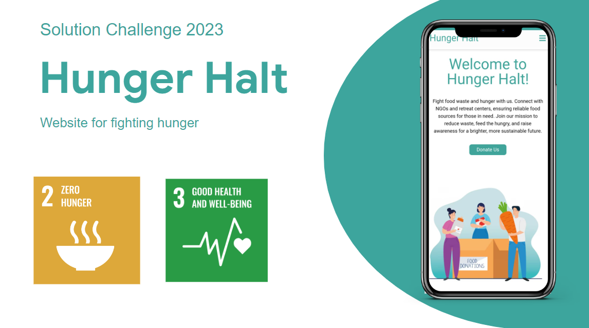
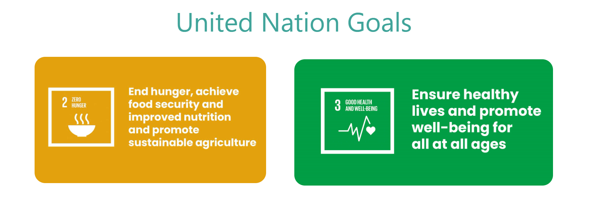
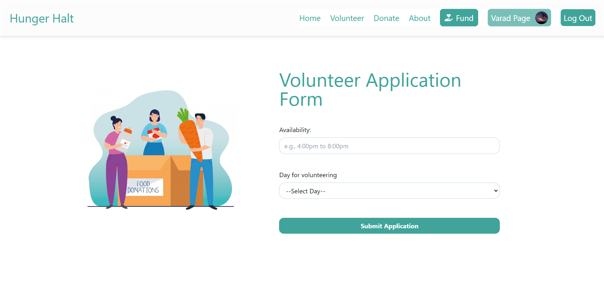
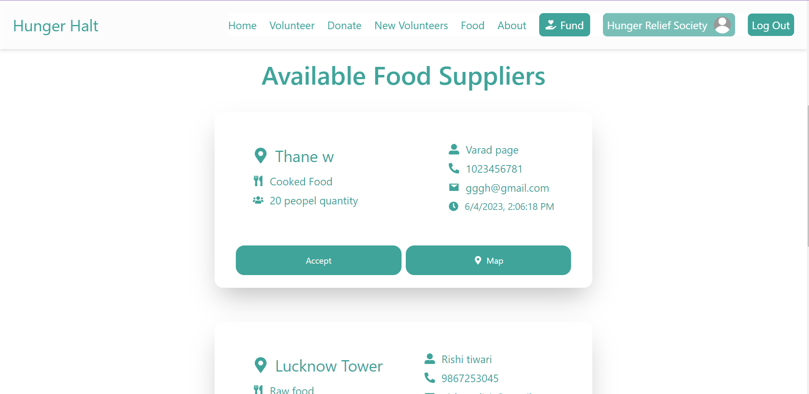

<!-- PROJECT TITLE -->
<div >
  <h1  style="bold"  >
    HUNGER HALT -Sustain
  </h1>
  
  <h3>
    A Solution Challenge 2023 Project
  </h3>
  <hr>
</div>


<h2>Overview</h2>
Food waste and hunger are major global issues. Around one-third of food produced for human consumption is wasted annually, while an estimated 690 million people suffer from hunger daily. These problems are interlinked and require a comprehensive approach.

<h2>What our project does for the same?</h2>

Our project aims to address the issues of food waste and hunger by creating a platform that connects users with NGOs/Retreate centres that are dedicated to feeding the hungry and providing food to those in need. By facilitating these connections, we hope to contribute to the achievement of food security and minimize the problem of food wastage.

Our goals include providing reliable and sustainable food sources to those in need, reducing food waste by channeling it to those who can use it, and raising awareness and encouraging action on the issues of food waste and hunger.
<br>
<br>




<h2>Sustainable Development Goals</h2>

To contribute to the Sustainable Development Goals, Hunger Halt aligns with "Zero Hunger" and "Good heatlh and well being". By reducing food waste and ensuring surplus food reaches those in need, our project addresses the global challenge of hunger and promotes sustainable practices in food consumption.




<h2>Project Overview</h2>

### Home Page- 
<br>


### Food Request Form- 
<br>


### Volunteer Form- 
<br>



### Food Cards For NGO's- 
<br>



### Volunteer Card For NGO's- 
<br>


<h2>Project Portals</h2>
Hunger Halt Website - https://hunger-halt.web.app/  
<br>
Hunger Halt Video : https://youtu.be/EQqf-oyWLzk


<h2>Key features</h2>

1. A platform for NGOs/Retreate centres dedicated to feeding the hungry and reducing food waste to connect with users who are interested in supporting these causes.

2. A donation page for users to donate edible food or raw food to NGOs that they support.

3. A volunteer section where users can upload their convenient time slot and select a day for volunteering,

5. An easy-to-use interface that makes it easy for users to navigate the website.

4. Use of google maps will enable NGO's to track the providers efficiently.

<br>
<h2>Google Technologies Used</h2>

<div class="flex ">
  


  
</div>

<br>

<h2>How to Setup</h2>

Clone the repository using 

```
git clone <repository-url>
```

Install dependencies using 
```
npm install
```
Change Directory
```
cd ./hunger-halt
```
Start the Project
```
npm start
```


<h2>About us</h2>

### Team Members 

1. Akash Gujju
2. Yaswanth Sai
3. Chandu Ummanaveni


The idea for the Hunger Halt project arose from our realization that food wastage and the number of people who go hungry every day are closely linked. We wanted to do something to address this issue by creating a platform that would enable people to provide food to those in need and contribute to a good cause in their own way.

